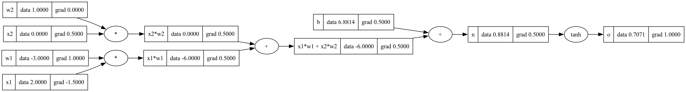

# YZ50 — Hafta 2: Backpropagation

Bu çalışma YZ50 programının ikinci hafta backpropagation ödevi kapsamında hazırlanmıştır.

Bu hafta Karpathy'nin micrograd yaklaşımını takip ederek küçük bir autograd mekanizmasını sıfırdan kurdum. Hazır otomatik türev sistemi kullanmadan computation graph, chain rule ve backward pass mantığını uyguladım.

## Tamamlanan görevler

### 1. Value sınıfı ve computation graph

- `Value` sınıfı oluşturuldu.
- Toplama ve çarpma işlemleri eklendi.
- Her `Value`, kendisini oluşturan önceki node'ları ve operasyonu saklıyor.
- Computation graph Graphviz ile görselleştirildi.

### 2. Manuel backpropagation

Karpathy videosundaki iki örneğin gradient'leri önce elle hesaplandı:

- Basit ifade: `L = ((a * b) + c) * f`
- Tek nöron: `o = tanh(x1*w1 + x2*w2 + b)`

### 3. Otomatik backward()

- Node'lar topological sıraya yerleştirildi.
- Çıktının gradient'i `1.0` olarak başlatıldı.
- Graph ters sırayla dolaşıldı.
- Her node kendi local derivative'ını üstten gelen gradient ile çarptı.
- Aynı değişken birden fazla yerde kullanıldığında gradient'ler `+=` ile toplandı.

### 4. Operasyonları parçalama ve doğrulama

- `tanh`; `exp`, `pow`, çıkarma ve bölme işlemlerine parçalandı.
- Aynı gradient sonuçları elde edildi.
- Gradient'ler üç yöntemle karşılaştırıldı:
  - Kendi `backward()` metodum
  - Numerical derivative
  - PyTorch autograd

Üç yöntemin sonuçları eşleşti.

| Parametre | backward() | Numerical | PyTorch |
|---|---:|---:|---:|
| x1 | -1.5 | -1.5 | -1.5 |
| x2 | 0.5 | 0.5 | 0.5 |
| w1 | 1.0 | 1.0 | 1.0 |
| w2 | 0.0 | 0.0 | 0.0 |
| b | 0.5 | 0.5 | 0.5 |

## Computation graph



Graph üzerinde her node'un forward pass değeri (`data`) ve backward pass gradient'i (`grad`) gösterilmektedir.

## Dosyalar

- `01_value_basics.py`: Value sınıfı, toplama ve çarpma
- `02_manual_backprop.py`: Basit ifadede manuel gradient hesabı
- `03_manual_neuron.py`: Tek nöronda manuel backpropagation
- `04_backward.py`: Otomatik backward mekanizması
- `05_tanh_expanded.py`: tanh'ın temel operasyonlara parçalanması
- `06_gradient_check.py`: backward, numerical derivative ve PyTorch karşılaştırması
- `07_graphviz.py`: Computation graph görselleştirmesi

## Çalıştırma

Python 3.12 kullanılmıştır.

```bash
python3 -m venv .venv
source .venv/bin/activate
pip install -r requirements.txt
python 06_gradient_check.py
python 07_graphviz.py