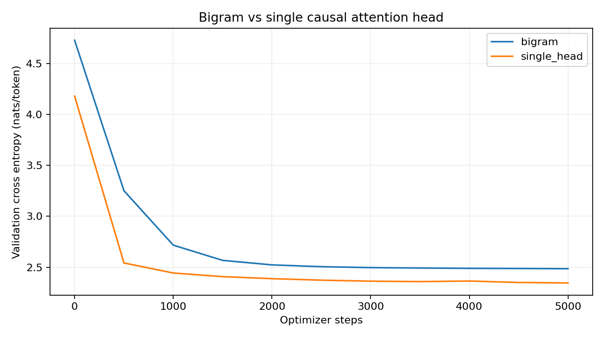
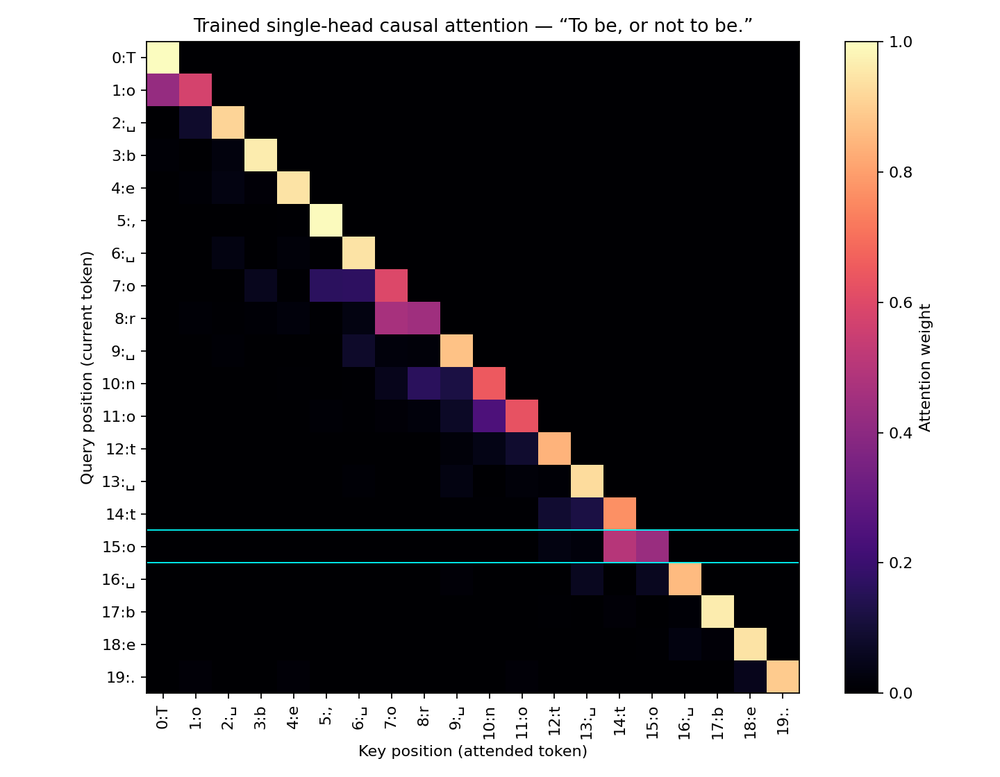

# YZ50 Hafta 7 — Bigram'dan tek self-attention head'e

**AI katkısı:** Bu klasördeki kod, deney çalıştırmaları ve açıklamalar OpenAI
Codex tarafından Tuğçe Karakuş'un isteğiyle hazırlanmıştır. Bu, yönergedeki
“kodu kendin yazacaksın” koşulunu karşılayan bağımsız öğrenci çalışması olarak
sunulmamalıdır. Öğrenme ve karşılaştırma için referans uygulamadır; video ve
kişisel değerlendirme öğrenci tarafından hazırlanacaktır.

Bu hafta tam GPT kurulmaz: karakter tokenizer, `nn.Module` bigram tabanı,
öğrenilen pozisyon embedding'i ve **tek causal self-attention head** kurulur.
Multi-head attention, feed-forward katman, residual bağlantı ve LayerNorm
eklenmemiştir.

## Çalıştırma

Repo kök dizininde Python 3.10+ ile:

```bash
python -m pip install -r hafta-7/requirements.txt
python hafta-7/test_models.py
python hafta-7/run_all.py --steps 5000 --threads 2
```

`run_all.py` veriyi indirip hash'ini doğrular, görev 1–3 gösterimlerini çalıştırır,
iki modeli eğitir, sonuçları ve bonus ısı haritasını üretir. Çıktılar
`hafta-7/results/`, ağırlıklar `hafta-7/checkpoints/` içindedir. Tekrar çalıştırma
bu klasördeki deney çıktılarını yeniler. Veri indirimi internet gerektirir;
indirilmiş aynı dosya varsa yeniden indirilmez.

Repodaki **eğitilmiş ağırlıkları** kullanarak yeniden eğitim yapmadan:

```bash
python hafta-7/05_heatmap.py
python hafta-7/generate.py --model single_head --tokens 400
python hafta-7/generate.py --model bigram --tokens 400
```

Gösterimleri ayrı ayrı çalıştırmak için önce
`python hafta-7/download_data.py`, ardından `01_data_preview.py`,
`02_averages.py` ve `03_attention_demo.py` çalıştırılabilir. Eğitim ayrı olarak
`python hafta-7/experiment.py --steps 5000` komutuyla da yapılır.

## 1. Veri, tokenizer, batch ve bigram

Tiny Shakespeare dosyasında **1.115.394 karakter ve 65 farklı sembol** vardır.
Harfler dışında boşluk, yeni satır ve noktalama da ayrı token'lardır.
Tiny Shakespeare, eğitim için kullanılan küçük Shakespeare derlemesidir;
bütün eserlerin eksiksiz arşivi olarak değerlendirilmez.

`encode` karakterleri indekslere, `decode` indeksleri karakterlere çevirir.
`sorted(set(text))` ile sabit bir sözlük oluşturulur. İlk **1.003.854 token**
train, son **111.540 token** val olarak ayrılır (%90/%10, tam sayı yuvarlamasıyla).
Rastgele başlangıçlar bu iki bölümün kendi içinden seçilir; pencere sınırı aşmaz.

`x[b,t]` girdiyken `y[b,t]` ondan **bir sonraki** karakterdir. Örnek:
`x="Let's he"`, `y="et's hea"`. Girdi ve hedef şekilleri `(B,T)`.
Bigram, `Embedding(65,65)` içinden yalnızca mevcut karaktere göre 65 sonraki
karakter logiti çıkarır. Hedefler ve logits düzleştirilerek cross entropy alınır.

Veri dosyası gereksiz tekrar depolamamak için Git'e eklenmez. İndirici sabit
kaynak commit'i `370cbcd448eb7daf32f21a6be560b70e0b33c4e3` kullanır.
Beklenen SHA-256:
`86c4e6aa9db7c042ec79f339dcb96d42b0075e16b8fc2e86bf0ca57e2dc565ed`.

## 2. Geçmişin ortalaması, üç yol

`02_averages.py` aynı `(2,8,4)` tensör için for döngüsü, normalize edilmiş
`torch.tril` matrisi ve maskelenmiş sıfır skorların softmax'ını kullanır.
Üç çift karşılaştırmanın tamamında `torch.allclose=True` elde edilir;
sayısal döküm `results/averages.json` dosyasındadır.

Matris çarpımının bir elemanı şu toplamdır:

`out[b,t,c] = Σ_j wei[t,j] × x[b,j,c]`.

Örneğin indeks 2'deki satır `[1/3,1/3,1/3,0,...]` olur. İlk üç token'ın her
özelliğini üçte bir ağırlıkla topladığı için bu bir ortalamadır. `tril` tek
başına ortalama vermez; satır toplamıyla bölmezsek geçmişin **toplamını** verir.
Softmax'ta izin verilen skorların hepsi 0 olunca eşit ağırlıklar, `-inf` olan
gelecek skorları için 0 çıkar. Öğrenilen attention'da izin verilen skorlar artık
eşit değildir; böylece sabit ortalama yerine girdiye bağlı ağırlıklı ortalama alınır.

## 3. Query, key, value, maske ve pozisyon

Query mevcut token'ın aradığı özellikleri, key erişilebilir token'ın eşleşme
özelliklerini, value ise o token'dan taşınacak bilgiyi temsil eden öğrenilmiş
lineer dönüşümlerdir. Bunlar aynı girdiden ayrı ağırlıklarla hesaplanır.

| Tensör | Şekil | İşlev |
|---|---|---|
| `idx` | `(B,T)` | Karakter indeksleri |
| Token + position embedding | `(B,T,C)` | İçerik ve pencere içindeki konum |
| `q`, `k`, `v` | `(B,T,H)` | Üç öğrenilmiş projeksiyon |
| `q @ k.transpose(-2,-1)` | `(B,T,T)` | Query satırı ile key sütununun benzerliği |
| `wei` | `(B,T,T)` | Gelecek gizlendikten sonraki satır softmax'ı |
| `wei @ v` | `(B,T,H)` | Bilginin ağırlıklı toplamı |
| Logits | `(B,T,65)` | Sonraki karakter skorları |

`t` satırı yalnızca `j<=t` sütunlarını görür; kendi token'ını görmek serbesttir.
Çünkü `t` konumu `t+1` karakterini tahmin eder. `t+1` girdisini görebilse hedef
zaten önünde olur ve eğitim sızıntısı oluşur. Maske softmax'tan **önce** uygulanır;
üst üçgen `-inf`, softmax sonrasında 0'dır. Her satırın toplamı yaklaşık 1'dir.

Pozisyon bilgisi olmayan attention işlemi token permütasyonuna eşdeğişimlidir;
içerikten tek başına kesin konum okuyamaz. Causal maske geçmişe erişimi sınırlar,
fakat öğrenilmiş konum temsili yerine geçmez. Bu uygulama `Embedding(block_size,C)`
ekleyerek her token'a pencere içindeki konumunu verir. Bu konumlar bütün metnin
mutlak indeksleri değil, rastgele eğitim penceresinin 0–31 indeksleridir.

### Neden √head_size ile bölüyoruz?

Bağımsız, ortalaması 0 ve varyansı 1 olan q/k bileşenleri varsayılırsa H adet
çarpımın toplamının varyansı H olur. H büyüdükçe skorlar büyür, softmax birkaç
token'da aşırı yoğunlaşabilir ve öğrenme zorlaşabilir. √H ile bölme varyansı
yaklaşık 1'e getirir. Eğitimden sonraki q/k dağılımının bu varsayımları tam olarak
sağladığı iddia edilmez.

`03_attention_demo.py`, 10.000 bağımsız örnekte H=64 için varyansı
**63,8770 → 0,9981** ölçer. Ayrı, elle seçilmiş `[1,2,4,8]` skorlarında:

| Skor | Bölmeden softmax | √64=8 ile bölerek softmax |
|---:|---:|---:|
| 1 | 0,000893 | 0,167028 |
| 2 | 0,002426 | 0,189268 |
| 4 | 0,017927 | 0,243025 |
| 8 | 0,978755 | 0,400680 |

Bu sayılar ölçeklemenin örnek etkisini gösterir; eğitilmiş attention satırı
değildir. Kodda bölen **head_size** değeridir, embedding boyutu değildir.

## 4. Ölçülmüş bigram / single-head karşılaştırması

| Model | Parametre | Train loss | Val loss |
|---|---:|---:|---:|
| Bigram tabanı | 4.225 | 2,4654 | **2,4864** |
| Tek causal attention head | 8.321 | 2,3242 | **2,3467** |

Val loss **0,1397 nat/token**, başlangıç bigram değerine göre **%5,62** düştü.
Bu oran doğruluk oranı artışı değildir; çapraz entropideki göreli azalmadır.

İki model aynı train/val ayrımında, aynı rastgele eğitim başlangıçlarıyla ve
**5.000 optimizer adımıyla** eğitildi: CPU, batch=32, block_size=32,
AdamW (varsayılan weight_decay=0,01), lr=0,003. Attention için C=32, H=32.
Başlatma seed=1337; eğitim batch seed=7331; ölçüm seed=4242 (val=4243).
PyTorch 2.14.1+cpu / Python 3.12.14 ortamı kullanıldı.

Val loss, her ölçümde **aynı 100 rastgele batch** üzerindeki ortalama cross
entropy'dir: 102.400 token tahmini. Pencereler örtüşebilir; bu değer bütün val
setinin eksiksiz taranması değildir. Son eğitim batch'inin loss'u da değildir.
Değerlendirme `eval()` ve `no_grad()` ile yapılır; eğitim RNG'sini tüketmez.

Bigram yalnız mevcut karakteri kullanırken attention son 32 karakter içinde
öğrenilen ağırlıklarla bilgi toplar. Daha düşük val loss bu ek bağlamdan yararlanma
ile tutarlıdır. Fakat parametre sayısı ve mimari de değiştiği, yalnız bir seed
kullanıldığı için farkın tamamını attention'a veya daha uzun bağlama nedensel
olarak bağlayamayız. Karşılaştırma eşit adım bütçesidir, eşit parametre/FLOP bütçesi değildir.



`results/bigram_sample.txt` ve `results/single_head_sample.txt` aynı `ROMEO:`
prompt'u ve seed=2026 ile üretilmiş 400 yeni karakter içerir. İkisinde de bozuk
kelimeler vardır; küçük tek head henüz akıcı Shakespeare üreten bir GPT değildir.

### Üretimde neden son block_size karakter?

`generate` her adımda `idx[:, -block_size:]` kullanır. Pozisyon embedding
tablosu ve maske yalnız block_size konumu destekler; daha uzun girdide pozisyon
indeksi taşar. Ayrıca eğitim de bu pencere uzunluğuyla yapılmıştır. Tüm üretilen
metin saklanır, yalnız sonraki karakter için kullanılan bağlam kırpılır. Bigram
kodunda ortak üretim yolu kullanılır; onun tahmini zaten yalnız son token'a bağlıdır.

## 5. Bonus (a): eğitilmiş attention ısı haritası



Girdi: `To be, or not to be.`. İşaretli **15. satır (0 tabanlı indeks)** ikinci
`to` sözcüğündeki `o` token'ıdır; sonraki hedef boşluktur.

| Key indeksi | Token | Ağırlık |
|---:|---|---:|
| 14 | `t` | 0,503401 |
| 15 | `o` | 0,433479 |
| 12 | `t` | 0,032109 |
| 13 | boşluk | 0,022910 |
| 11 | `o` | 0,002718 |
| 10 | `n` | 0,001696 |

Bu satır ağırlığının yaklaşık %93,69'unu mevcut `o` ve hemen önceki `t` üzerinde
toplar. 16–19 konumları gelecektedir ve ağırlıkları **0**'dır. Isı haritası genel
olarak yakın geçmişe ve kendi token'ına yoğunlaşmayı gösterir. Bu gözlem modelin
bu örnekte yerel bağlama ağırlık verdiğini gösterir; attention ağırlıkları tek
başına modelin kelime anlamını anladığının veya tahmin nedeninin kesin kanıtı değildir.

Tam matris ve satır dökümü: `results/attention_weights.json`,
`results/attention_row.txt`. Görev 3'teki eğitilmemiş head matrisi ayrı olarak
`results/attention_demo.json` içindedir. Bonus seçeneği (a) tamamlandı.

## Dosya eşlemesi ve doğrulama

| Görev | Dosyalar |
|---|---|
| 1 — veri, tokenizer, batch, bigram | `data.py`, `01_data_preview.py`, `models.py`, `experiment.py` |
| 2 — üç geçmiş ortalaması | `02_averages.py`, `results/averages.json` |
| 3 — q/k/v, maske, pozisyon, ölçek | `models.py`, `03_attention_demo.py` |
| 4 — eğitim ve karşılaştırma | `experiment.py`, `results/results.json`, `results/loss.png` |
| 5(a) — eğitilmiş ısı haritası | `05_heatmap.py`, `results/attention_heatmap.png` |
| Video hazırlığı | `VIDEO_NOTES.md` |

`test_models.py` dört kontrolden oluşur: tokenizer/batch hedef hizası, causal
maskenin geleceğe sızmaması ve satır toplamları, logits/gradient/uzun üretim,
embedding boyutundan farklı H kullanıldığında doğru √H ölçeği. Hepsi geçti.

Hafta 6'daki BatchNorm hata gösterimi mevcut `hafta-6/test_layers.py` ve README'de
bulunuyor; bu çalışmada hafta 6 dosyaları değiştirilmedi.

## Kaynaklar

- [Karpathy videosu (ilk 1:21:59)](https://www.youtube.com/watch?v=kCc8FmEb1nY)
- [Ders notebook'u](https://colab.research.google.com/drive/1JMLa53HDuA-i7ZBmqV7ZnA3c_fvtXnx-?usp=sharing)
- [Ders kaynak reposu](https://github.com/karpathy/ng-video-lecture)
- [Sabit Tiny Shakespeare verisi](https://raw.githubusercontent.com/karpathy/char-rnn/370cbcd448eb7daf32f21a6be560b70e0b33c4e3/data/tinyshakespeare/input.txt)
- [Vaswani ve diğerleri, Attention Is All You Need, §3.2.1](https://arxiv.org/abs/1706.03762)
